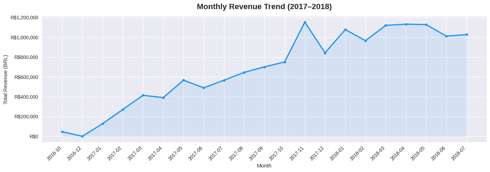
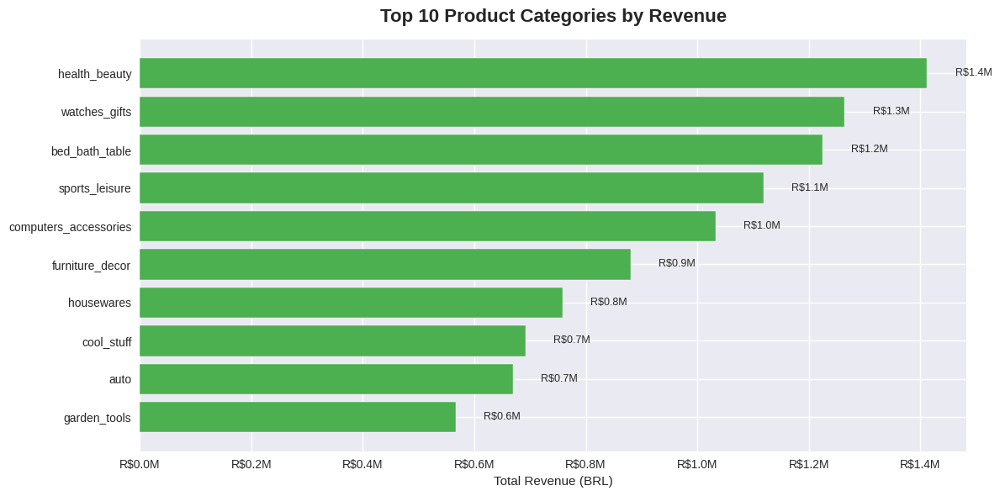
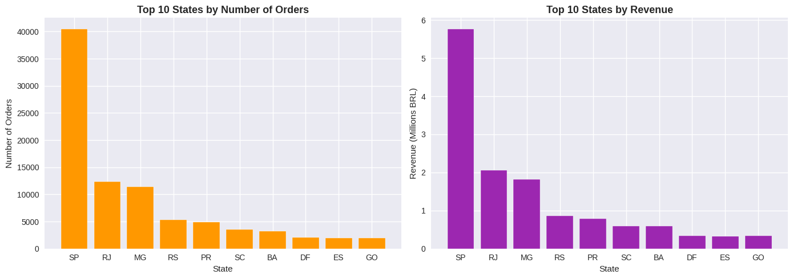
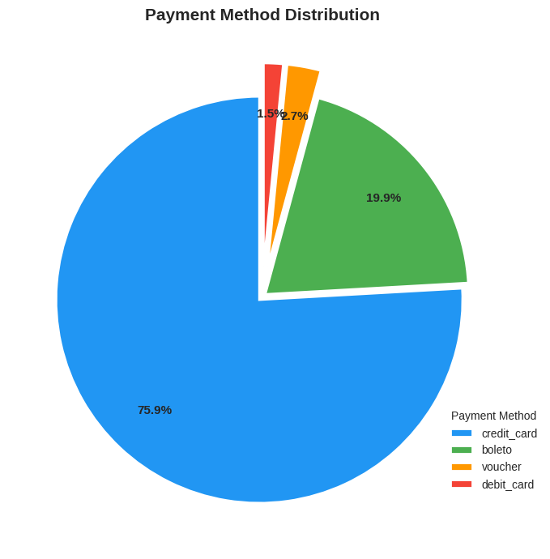
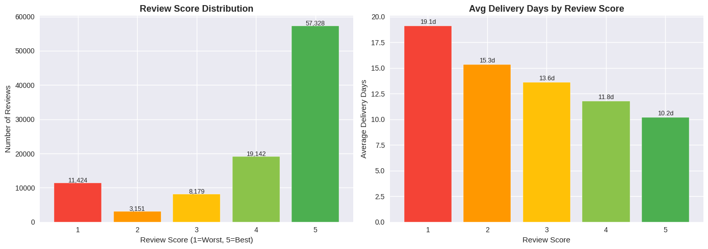

# Exploratory-Data-Analysis-EDA-Project
# 🛒 Olist E-Commerce: Exploratory Data Analysis

## 📌 Project Overview
End-to-end Exploratory Data Analysis on a real Brazilian e-commerce dataset
(Olist) containing **99,441 orders** across **8 related tables** from 2016–2018.

This project covers data cleaning, feature engineering, multi-table joins,
and business insight generation — simulating a real analyst workflow.

---

## 🎯 Business Questions Answered
1. How did monthly revenue trend over time?
2. Which product categories generate the most revenue?
3. Which states drive the most orders and revenue?
4. What payment methods do customers prefer?
5. Does delivery speed affect customer satisfaction?

---

## 📊 Key Insights

### 1. 📈 10x Revenue Growth with Black Friday Spike
Revenue grew from R$75K (Oct 2016) to R$1.17M (Nov 2017) — a **10x increase
in 13 months**. A sharp November 2017 spike indicates a successful Black Friday
campaign. Revenue stabilized around R$1M/month through 2018.

---

### 2. 🛍️ Health & Beauty Leads All Categories
Top 3 categories — **health_beauty (R$1.4M), watches_gifts (R$1.3M),
bed_bath_table (R$1.2M)** — are all lifestyle/personal products, suggesting
a consumer market driven by self-care and gifting.

---

### 3. 🗺️ São Paulo Drives 42% of All Orders
SP alone accounts for ~40,000 orders and ~R$5.8M revenue — **3x more than
the next state (RJ)**. The top 3 states (SP, RJ, MG) represent ~70% of volume,
indicating a high geographic concentration risk.

---

### 4. 💳 Credit Card Dominates at 75.9%
3 in 4 customers pay by credit card. Boleto (Brazil's bank slip) accounts for
19.9%, suggesting a significant portion of buyers are in lower-income segments.
Installment-based promotions could unlock higher average order values.

---

### 5. ⭐ Delivery Speed = Customer Satisfaction
Orders delivered in **~10 days → 5-star reviews**.
Orders taking **~19 days → 1-star reviews**.
A **9-day difference** separates happy from unhappy customers.
11,424 orders received 1-star ratings — a major churn risk.

---

## 🔑 Key Metrics
| Metric | Value |
|--------|-------|
| Total Delivered Orders | 96,478 |
| Average Delivery Time | 12.1 days |
| Top Revenue Category | Health & Beauty (R$1.4M) |
| Top State by Orders | São Paulo (42%) |
| Dominant Payment Method | Credit Card (75.9%) |
| 5-Star Reviews | ~57% |
| 1-Star Reviews | ~11% |

---

## 💡 Business Recommendations
- **Logistics:** Set a delivery SLA of under 12 days. Flag orders at day 15
  for proactive customer communication.
- **Marketing:** Double down on Health & Beauty and Watches categories
  with targeted campaigns before Q4/Black Friday.
- **Growth:** Launch campaigns in mid-tier states (RS, PR, SC) to reduce
  dependency on SP/RJ/MG.
- **Payments:** Offer 0% installment promotions on high-ticket items
  (watches, computers) to boost conversion.

---

## 🛠️ Tools & Libraries
- **Python** — Pandas, NumPy, Matplotlib, Seaborn
- **Google Colab** — Development environment
- **Dataset** — [Olist Brazilian E-Commerce (Kaggle)](https://www.kaggle.com/datasets/olistbr/brazilian-ecommerce)

---

## 📁 Dataset Files Used
| File | Description |
|------|-------------|
| olist_orders_dataset.csv | Order status and timestamps |
| olist_order_items_dataset.csv | Items, price, freight per order |
| olist_customers_dataset.csv | Customer location data |
| olist_products_dataset.csv | Product details and categories |
| olist_order_payments_dataset.csv | Payment method and value |
| olist_order_reviews_dataset.csv | Customer review scores |
| olist_sellers_dataset.csv | Seller information |
| product_category_name_translation.csv | Portuguese → English categories |

---

## 👤 Author
**Your Name**  
Aspiring Data Analyst  
[LinkedIn](https://linkedin.com/in/yourprofile) • [GitHub](https://github.com/yourusername)
